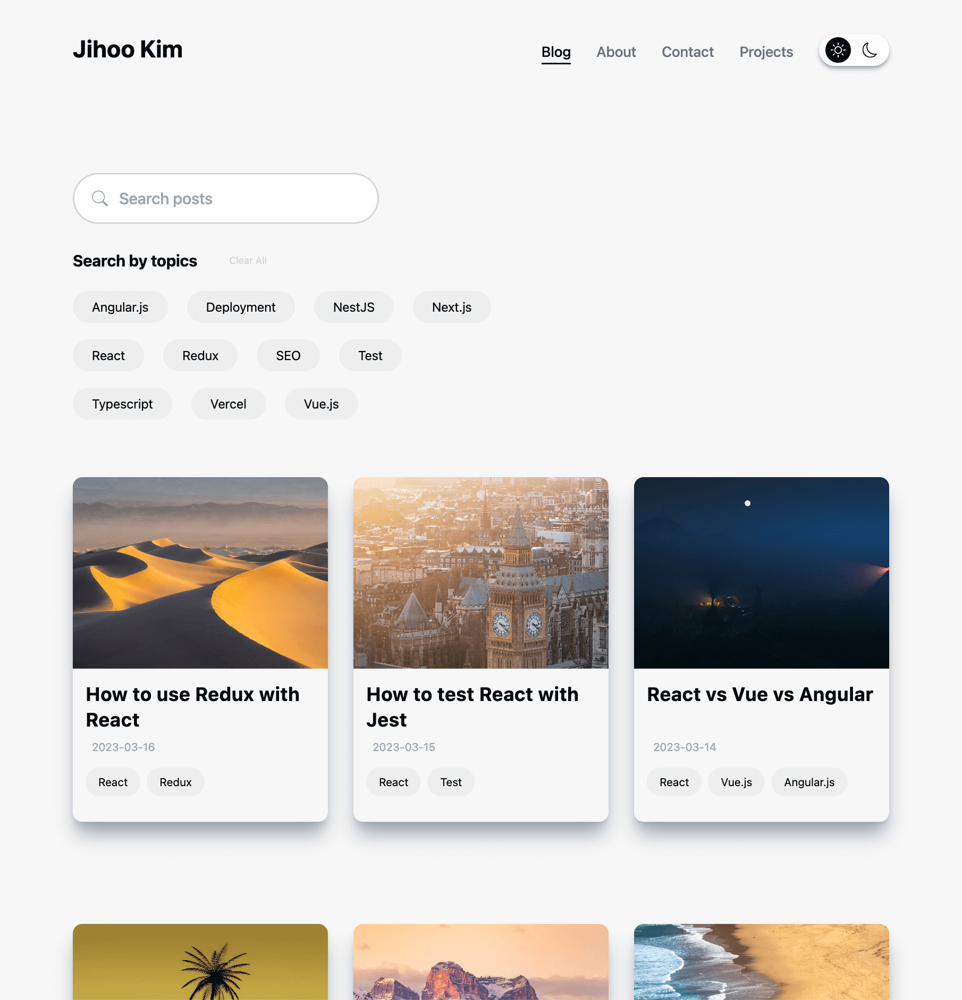
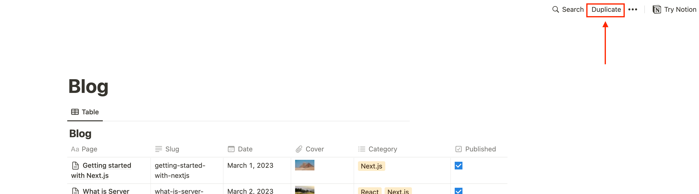
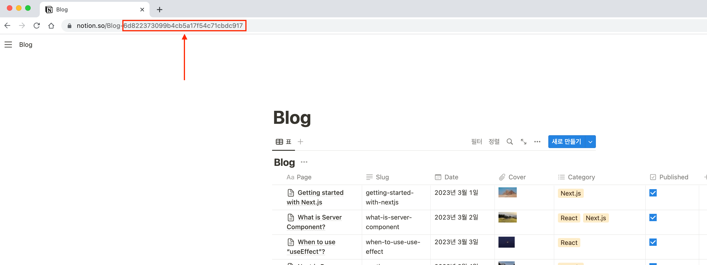
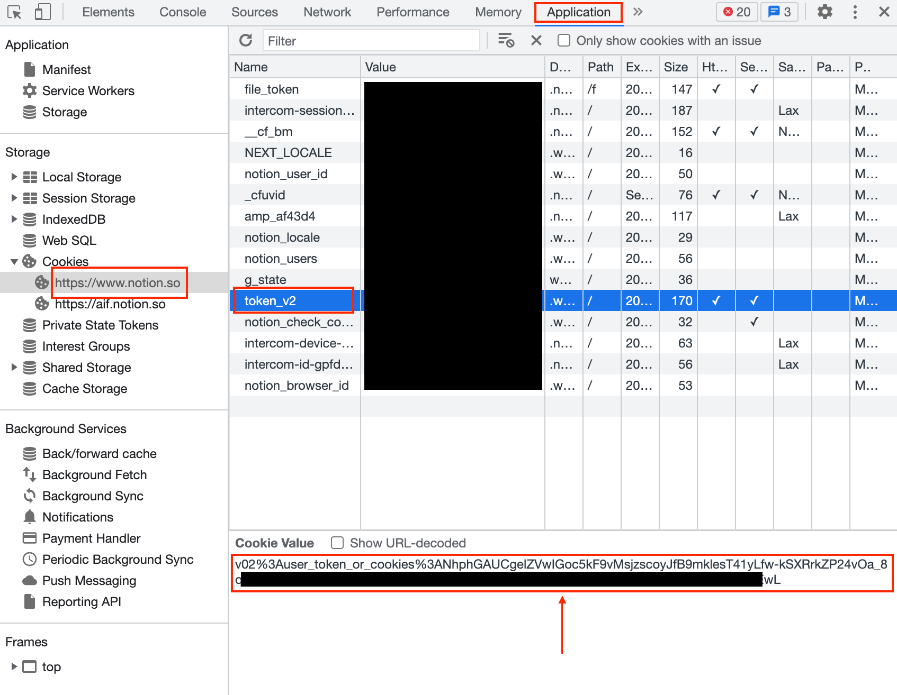
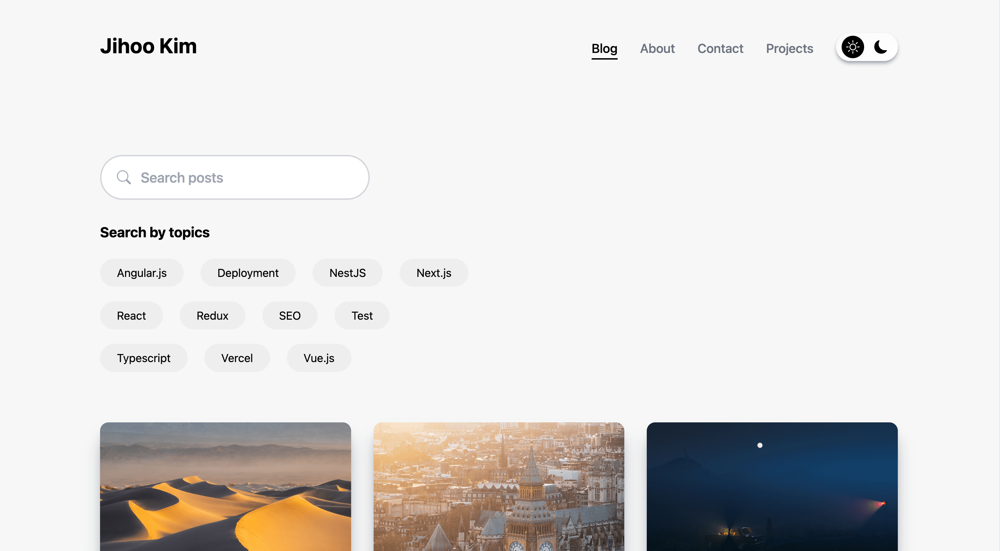
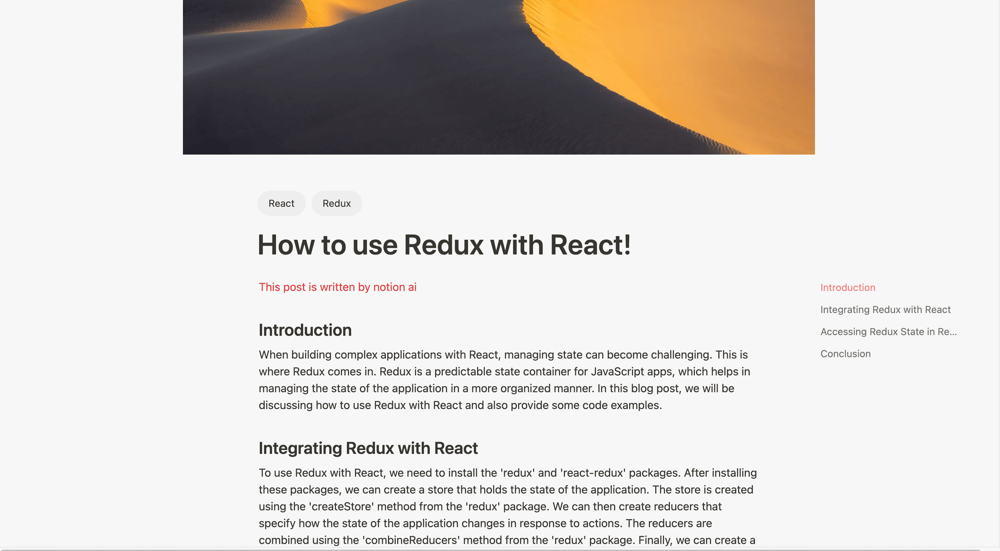
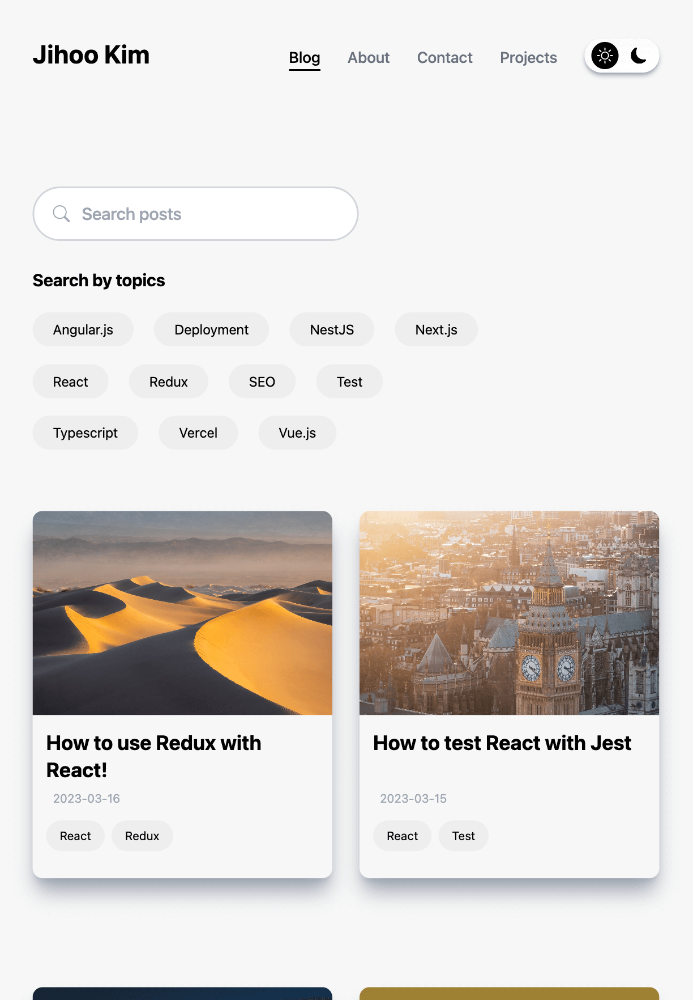
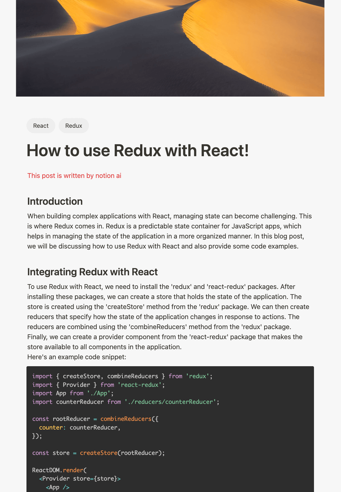
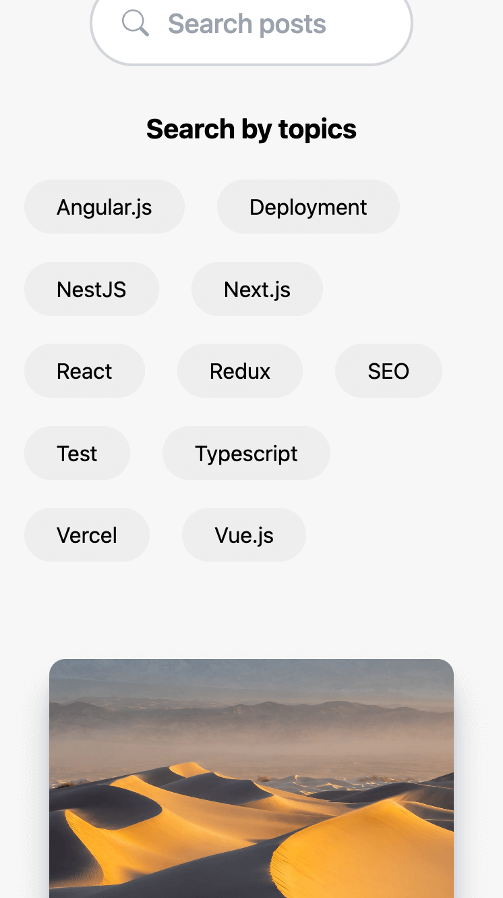
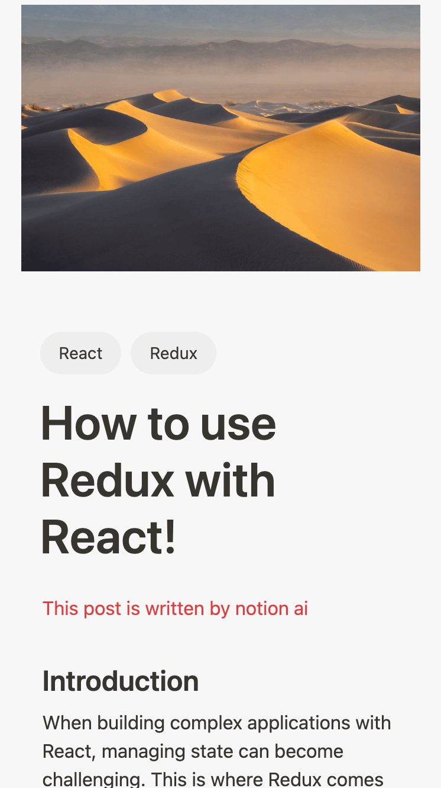

# Notion Blog with Next.js 13

  

## Contents
- [Introduction](#-introduction)
- [Demo](#-demo)
- [Features](#-features)
- [Major Dependencies](#-major-dependencies)
- [Getting Started](#-getting-started)
- [Screenshots](#screenshots)
- [TODO](#-todo)

## 🚀 Introduction
This is a blog template that uses Notion as CMS. 
Upload posts in Notion, share them through your blog! 
**This project uses `App Router` that is now stable in Next.js 13.4.**

## 👀 Demo
Check out the demo site [HERE](https://notion-blog-wildcatco.vercel.app/blog)

https://www.youtube.com/watch?v=rZgh8a4ZjA8

## 🌟 Features
- Simple to sync Notion and blog
- Search posts by name
- Filter posts by categories
- Related posts
- Dark mode
- Responsive design
- Sitemap

## 📦 Major Package Dependencies
- [react-notion-x](https://www.npmjs.com/package/react-notion-x): Renderer for notion pages
- [notion-client](https://www.npmjs.com/package/notion-client): Unofficial Notion API which is much faster than official Notion API

## 🏁 Getting Started
1. Duplicate [this](https://curved-kale-c2a.notion.site/Blog-6d822373099b4cb5a17f54c71cbdc917) notion blog template to your notion workspace. (Make your notion page public.)
 
   
2. Visit your notion page with **browser**.
3. Check your database id in the url. (needed as an environment variable)
 
   
4. Check your auth token in the cookie. (needed as an environment variable)
 
   
 
5. Now you can run on local or deploy to [Vercel](https://vercel.com/dashboard) with environment variables listed [below](#environment-variables).

**Slug should be unique because it's used as url of the post page**

### Environment Variables
`NOTION_DATABASE_ID`: getting started step 3 
`NOTION_AUTH_TOKEN`: getting started step 4 
`SITE_URL`: URL of your site (http://localhost:3000 in local environment) 
`API_KEY`: Choose your own password for route handler

## Screenshots
### Desktop

  
  

### Tablet

  
  

### Mobile

  
  

## 📝 TODO
- [ ] Light mode for code block
